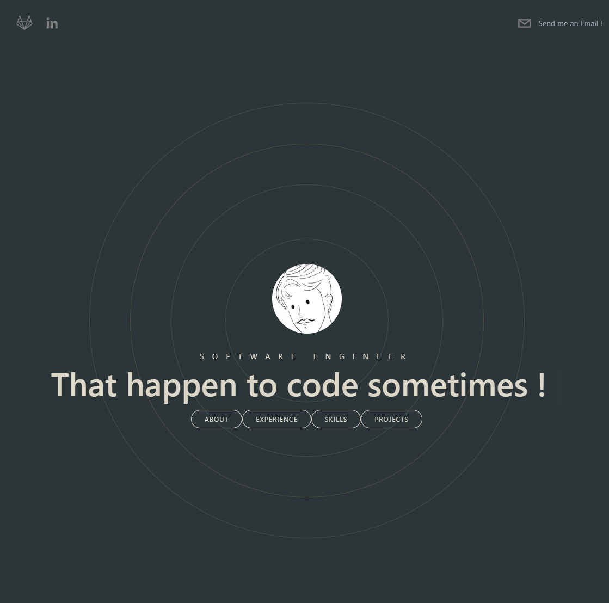

# Portfolio Guillaume Excoffier

[https://portfolio-guillaume-omega.vercel.app/](https://portfolio-guillaume-omega.vercel.app/)

## Context

Inspo from the great youtube channel of [Sonny](https://www.youtube.com/c/SonnySangha):

[Let's build a Modern Portfolio with NEXT.JS (Framer Motion, Tailwind CSS, Sanity.io, React)](https://www.youtube.com/watch?v=urgi2iz9P6U)

## Stack

- [Next.js](https://nextjs.org) - A React framework with hybrid static & server rendering, and route pre-fetching, etc.
- [Tailwind CSS](https://tailwindcss.com) - A utility-first CSS framework that can be composed to build any design, directly in your markup.
- [TypeScript](https://typescriptlang.org) - TypeScript is a strongly typed programming language that builds on JavaScript, giving you better tooling at any scale.
- [Framer Motion](https://www.framer.com/motion/) - A production-ready motion library for React.
- [Vercel](https://vercel.com/) - A hosting solution that works best with Next.js. Directly linked to the gitlab repo of the project.

### Dev

- [Eslint](https://eslint.org/) - ESLint statically analyzes your code to quickly find problems.
- [Prettier](https://prettier.io/) - Prettier is an opinionated code formatter. It removes original styling and ensures that all outputted code conforms to a consistent style.

## Local commands

`yarn install` - To add the node_modules

`yarn dev` - To start the project

## TODO

- [x] center section title
- [ ] Rework totaly experience with metaversemadness style (https://metaverse-madness-site.vercel.app/#explore)
- [ ] Rework skills to work better in responsive small (768 + is ok)
- [ ] Contact me should be fine if we fix above issues